---
This lesson was written in the form of an article to demonstrate FISSURE as an RF reverse engineering tool. Additional ceiling fan information could be added throughout the sections over time.

## Table of Contents
1. [Introduction](#introduction)
2. [Monitoring](#monitoring)
3. [Collection](#collection)
4. [Replay](#replay)
5. [Analysis](#analysis)
6. [Research](#research)
7. [Demodulation](#demodulation)
8. [Injection](#injection)
9. [Vulnerability Analysis](#vulnerability_analysis)
10. [Conclusion](#conclusion)

 

## Introduction

This is another walkthrough of reverse engineering a simple RF protocol using FISSURE and software-defined radios (SDRs). This time we will be looking at remote controls for two indoor ceiling fan units with lights. I recently swapped out a broken receiver unit for a Hunter ceiling fan, where the light control had stopped working. The replacement unit I ordered was plug and play, but it turned out to be a different model because the old model was discontinued. The two receiver unit models are incompatible in that the remote for one cannot control the other. Since I have two remote controls to work with, I will refer to them as old and new. We will follow the same RF reverse engineering process used in the past, but this time, we will highlight the on-off keying (OOK) signal generator feature within FISSURE.

 

## Monitoring

The remotes each have six buttons, though arranged differently. These are: fan off, fan low, fan medium, fan high, light/dimmer, and reverse direction. We'll begin by detecting the signals and analyzing their timing and frequency behavior for each button press.

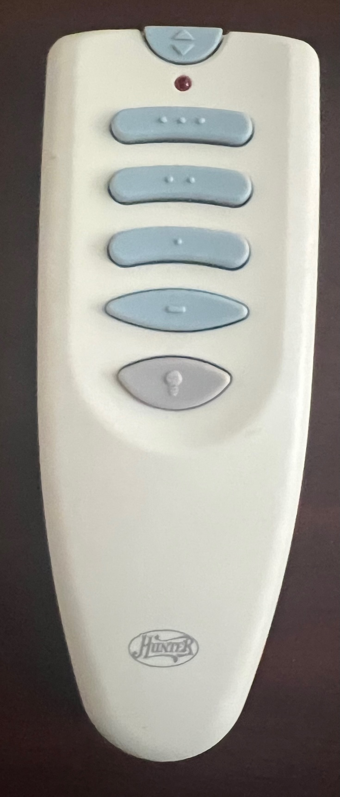

*Old Remote (Front)*

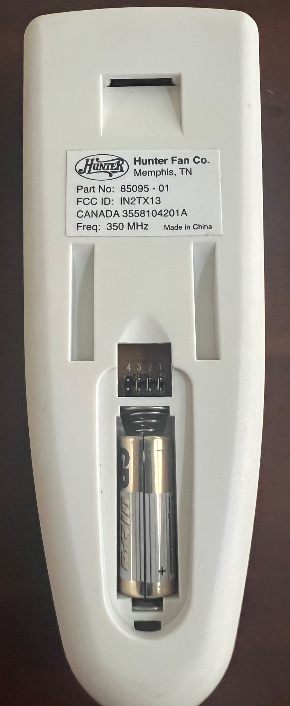

*Old Remote (Back)*

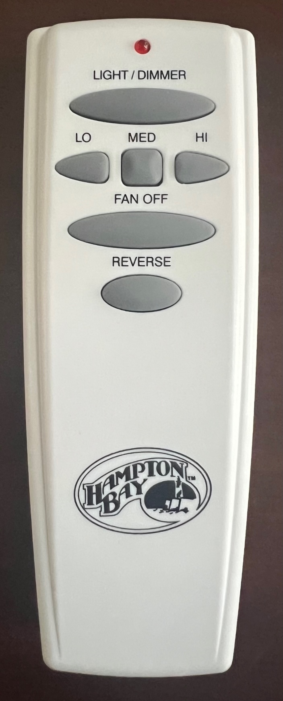

*New Remote (Front)*

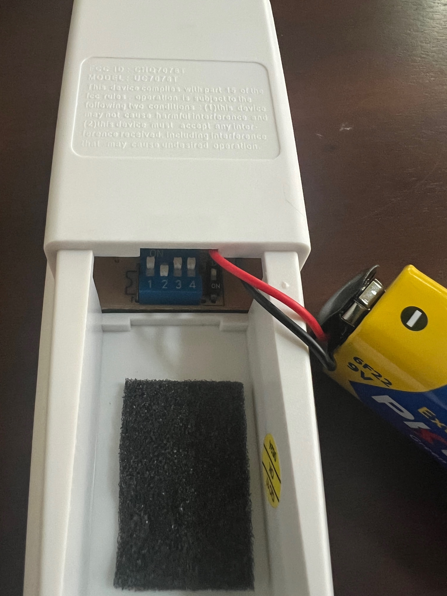

*New Remote (Back)*

**Old Remote**

The back of the old remote is labeled with "350 MHz," but the waterfall inspection flow graph shows a frequency closer to 349.9 MHz. The frequencies for each button vary by a few kHz but remain consistently within the same channels over time. This slight shift may be unintentional and unlikely to affect message reception. Unfortunately, we can't test this theory, as I’m unwilling to climb a ladder to reinstall the old unit. Our analysis of the old remote will illustrate how RF reverse engineering can be hindered when one part of the test setup is unavailable for observation.

*Waterfall Plot of Old Remote for the Six Buttons*

The time-domain signals observed in FISSURE’s time sink inspection flow graphs show consistent patterns for each of the six buttons. The remote continues transmitting as long as the button is pressed. The only difference between buttons is the content of each message in the burst. As is common with many 300 MHz remotes, the signals appear to use OOK modulation, with no evidence of frequency or phase modulation.

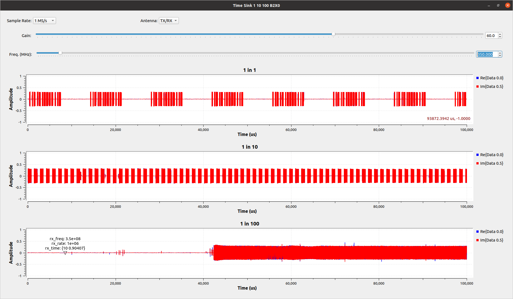

*Time Sinks of Old Remote Button Press*

**New Remote**

Unfortunately, the new remote does not have the frequency listed on it. While we could look up the FCC ID, we can also use the FISSURE “TSI - Detector” tab to search several frequency bands. The remote’s frequency is not the same as the old one, but it likely falls within an unlicensed band near 315 MHz, 433 MHz, or 900 MHz. After setting up the three search bands and pressing the remote's buttons repeatedly, the strongest signal was detected around 303.7 MHz. It’s important to note that harmonics of the signal can appear at multiples of the base frequency, which explains the signal detected at 911 MHz, and likely another at 607 MHz. Any other signals listed below were either transmitted by nearby devices or are artifacts from the scanning that showed up erroneously.

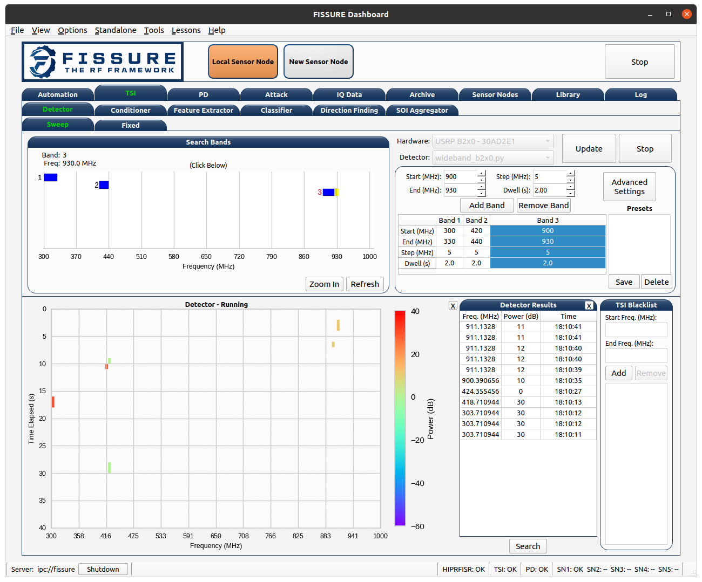

*Search Bands in TSI - Detector Tab*

 

## Collection

FISSURE’s “IQ Data - Record” tab, paired with an SDR, was used to capture IQ files of the button presses for both remotes. The FISSURE crop tool helped reduce the file size, making it easier to zoom in and pan within the data viewer. We only need to focus on a short time window—just a few messages wide—since the pattern remains consistent as long as the button is held down.

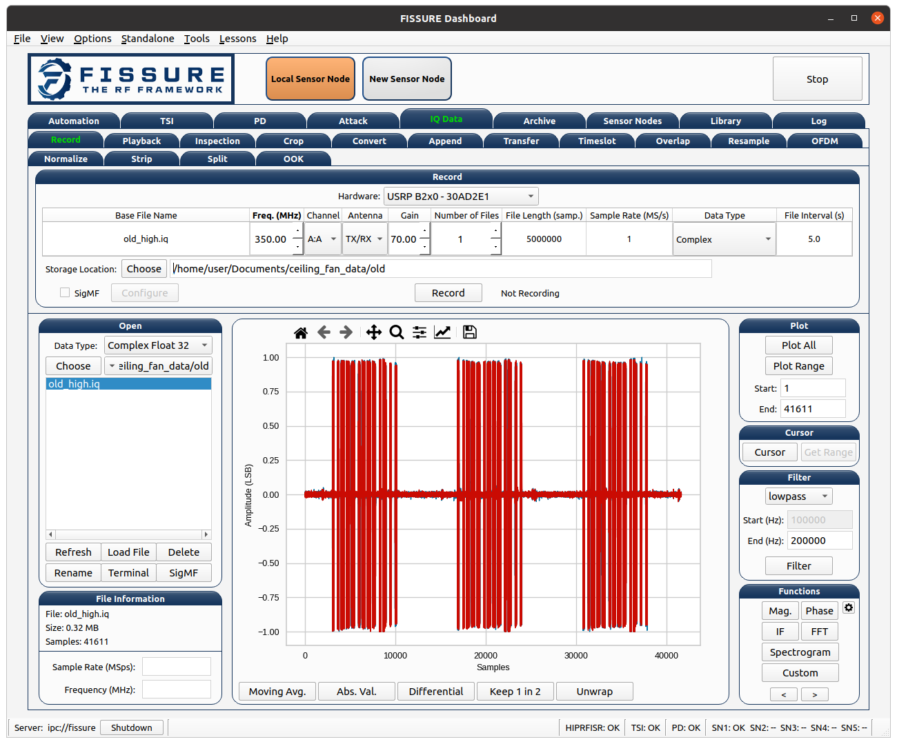

*Recording IQ File for Old Remote*

To quickly isolate the messages in a file like the ones shown above, you can use either the “IQ Data - Split” or “TSI - Conditioner” tabs. The “IQ Data - Strip” tab and the “Strip” button in the “TSI - Conditioner” tab can remove any extra empty samples before and after the signal.

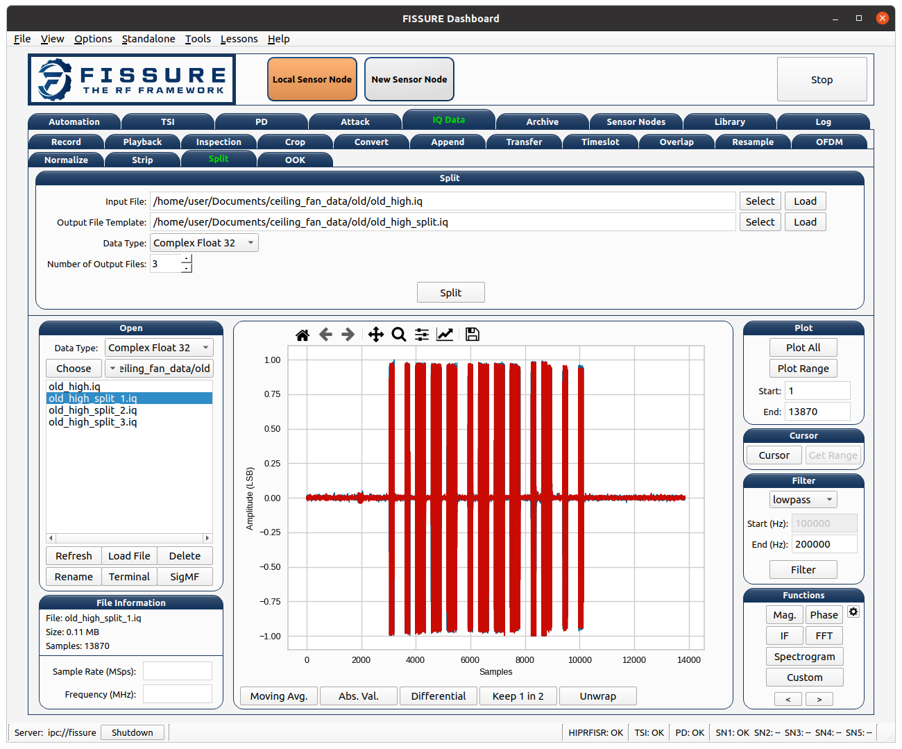

*IQ Data - Split Tab for Isolating Signals*

*TSI - Conditioner Tab for Isolating Signals*

 

## Replay

The IQ files recorded from the new remote were replayed by an SDR and successfully communicated with the fan. While replaying the messages will not point out potential concepts like sequence numbers or counters—since the message data remains constant for each button press—we can still determine the minimum number of messages and the spacing needed to trigger a response from the fan. A single message is not enough, but by cropping the burst, we find that about three consecutive messages are required.

 

## Analysis

There are only a few key areas to measure when analyzing these types of signals, and just a couple messages need to be recorded to obtain the following measurements:
- The duration of the smaller chips/bits (T1)
- The duration of the larger chips/bits (T2)
- The space between two smaller chips/bits in a row (T3)
- The space between two larger chips/bits in a row (T4)
- The space between a smaller chip/bit and a larger chip/bit (T5)
- The space between a larger chip/bit and a smaller chip/bit (T6)
- The interval between the start of two messages (T7)

**Old Remote**

| Variable | Value |
|------------|------------|
| T1 | 200 us |
| T2 | 400 us |
| T3 | 400 us |
| T4 | 200 us |
| T5 | 200 us |
| T6 | 400 us |
| T7 | 13.85 ms |

From these measurements, the old remote can be divided into a chipping sequence where a “0” bit and “1” bit can be represented by three chips:
- 0: 010 – 600 us total
- 1: 110 – 600 us total
- Note: the chipping sequence could also be 001/011

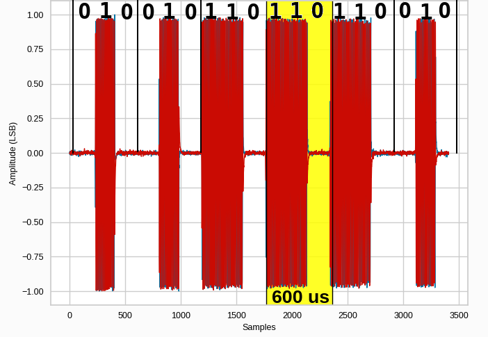

*Old Remote Chipping Sequence*

**New Remote**

| Variable | Value |
|------------|------------|
| T1 | 300 us |
| T2 | 650 us |
| T3 | 730 us |
| T4 | 380 us |
| T5 | 395 us |
| T6 | 710 us |
| T7 | 24.7 ms |

The new remote is not as evenly divided in our measurements, but it roughly follows the same chipping pattern:
- 0: 010 – 1030 us total
- 1: 110 – 1030 us total

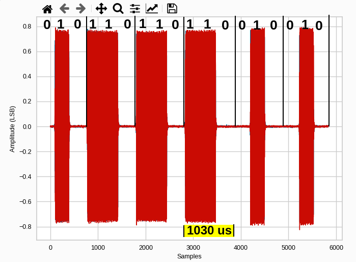

*New Remote Chipping Sequence*

 

## Research

Starting our research with the FCC ID provides access to the user manual and test reports. The user manual for the new remote (FCC ID: CHQ7078T) indicates that there are five DIP switches accessible after removing the battery. These are numbered 1-4 and D/ON, with the former being the address codes and the latter controlling the dimmer functionality or setting the light to only on/off states when the light/dimmer button is pressed. The old remote (FCC ID: IN2TX13) features four sets of pins numbered 1-4, with three jumpers for pairing the address on both the receiver and transmitter. It lacks a dimmer switch, but the manual notes that holding the button down will slowly dim the light, which is also the behavior of the new remote when its switch is set to D. The test reports list the frequency for the new remote as 303.835 MHz, though our FFT shows the signal centered at 303.719 MHz.

Searching for additional resources online led me to a couple of GNU Radio examples for fan controls. In a 2014 article, Clayton Smith (argilo) details nearly the same process we are following now, and like me, he first identified the harmonics. He created GNU Radio flow graphs for both transmitting and receiving, which appear to show the same bit sequences as the new remote. While the receiver only displayed the signal's magnitude, the transmitter worked out of the box after I adjusted it for my remote’s address values. Smith measured the symbol rate at 3211 baud (311.429 µs per chip, 311.429 µs × 3 = 934.288 µs), which differed from my measurement of 1030 µs, but it was close enough for practical purposes. Links to his solution are listed below:
- https://irrational.net/2014/03/23/reverse-engineering-a-ceiling-fan/
- https://github.com/argilo/sdr-examples

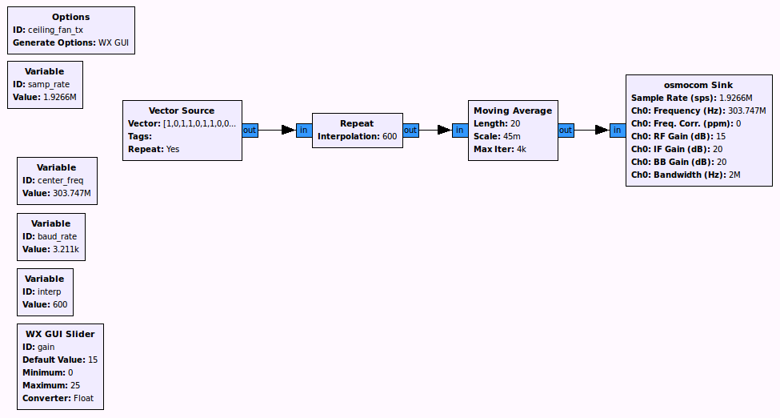

*Smith’s GNU Radio Flow Graph for Transmitting New Remote Signals*

The article also lists the bit patterns he observed for the different buttons, which can be used for comparison later on:
- off:   0110100000010
- low:   0110100001000
- med:   0110100010000
- high:  0110100100000
- light: 0110100000001

There is another video/article using an RTL dongle, *Spektrum* (a great tool for fast scanning with an RTL), and *Universal Radio Hacker*. The remote in this article is very similar to mine but has extra address bits. Links to this example are listed below:
- https://www.rtl-sdr.com/hacking-a-ceiling-fan-radio-control-signal-with-an-rtl-sdr/
- https://www.riveducha.com/decode-wireless-signal-with-usb-tv-tuner

It seems that many others have already explored this topic, so there may be more code and articles online that I can reference if I need to uncover something more about how these messages work. However, I did not find a complete solution that I could reuse for demodulation or transmission. Neither of the remotes was detected by an older version of *rtl_433* when tuned to their frequencies.
    

 

## Demodulation

At this point, we know nearly everything about these remote controls, except for the meaning of the bits. After visually inspecting the recorded signals from both remotes, we can list them as follows, with the differing fields highlighted:

**Old Remote (Jumpers 1-3 Set)**

- Fan High:          001110111**0100**
- Fan Medium:        001110111**0010**
- Fan Low:           001110111**0001**
- Fan Off:           001110111**1001**
- Light/Dimmer:      001110111**1000**
- Reverse Direction: 001110111**1010**

**New Remote (Five Switches: 1011-1)**

- Fan High:          0110111**100000**
- Fan Medium:        0110111**010000**
- Fan Low:           0110111**001000**
- Fan Off:           0110111**000010**
- Light/Dimmer:      0110111**000001**
- Reverse Direction: 0110111**000100**

**New Remote (Five Switches: 0100-1)**

- Light/Dimmer:      01**0100**1000010

**New Remote (Five Switches: 0100-0)**

- Light/Dimmer:      010100**0**000010

Studying these sequences reveals that the button data appears near the end of the message, while the address bits are towards the front. The new remote includes a bit for the “Dimmer/ON” switch after the address code. The purpose of the leading bits remains unclear, but they could be for synchronization, additional addressing, or distinguishing between models. Since there is no further functionality in the fan that I need to explore, I am content leaving a bit of mystery.

I could easily build GNU Radio flow graphs to demodulate these signals and extract the bits, button type, address codes, and dimmer/on setting. However, I’ll leave that for a future lesson and plan to integrate it into FISSURE (possibly as an out-of-tree module on GitHub). The same applies to transmitting signals, but in the next section, I will cover an alternative method in FISSURE for transmitting OOK signals.

 

## Injection

Technically, our research led us to someone who has already created a flow graph that successfully transmits the bits for my fan. Rather than recreating it, I’ll demonstrate the “IQ Data - OOK” tab, which serves as a generic signal generator for OOK signals. There is also a “General” FISSURE attack that includes a custom GNU Radio block, which translates the parameters from this tab into a flow graph, allowing it to be included in attack playlists.

Our new remote signals can be recreated in this tab from the following values acquired in our analysis:
- Chip “0” Pattern: 010
- Chip “1” Pattern: 110
- Burst Interval (µs): 13850
- Sample Rate (MS/s): 1
- Chip “0” Duration (µs): 343.333 (1030 µs/3)
- Chip “1” Duration (µs): 343.333
- Number of Bursts: 3 (minimum)
- Data Type: Complex Float 32
- Chip/Bit Sequence: 0110111000010 (13 bits, Fan Off)

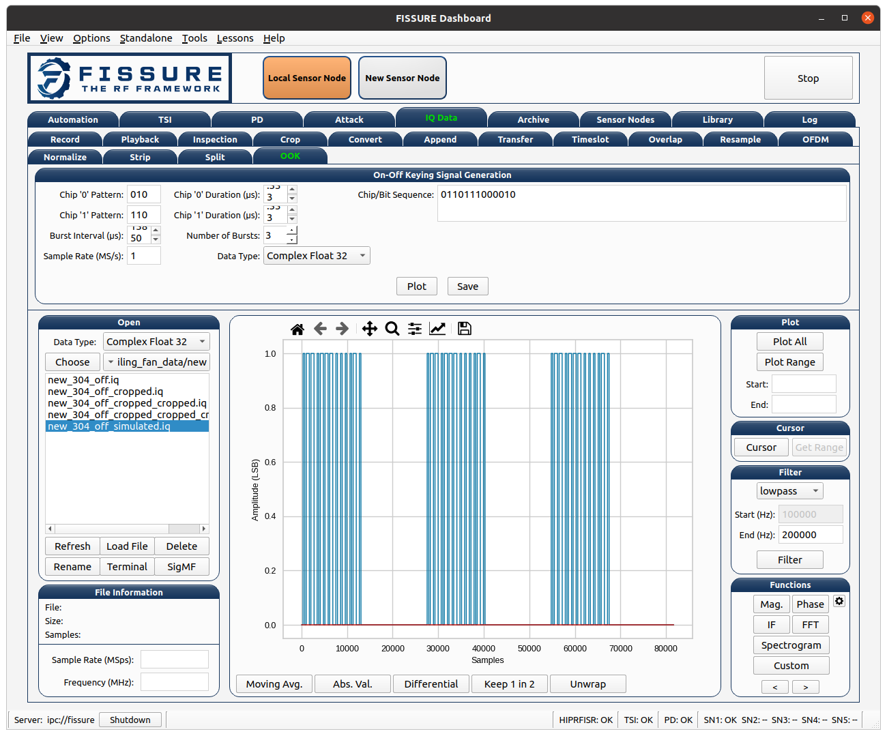

*OOK Signal Generator for Simulating the New Remote*

Clicking the plot button will display the generated signal in the data viewer, and the save button will write it to an IQ file. This file can be played back at 303.719 MHz to control the fan. The only change for different button presses is the "Chip/Bit Sequence" field, which could someday be integrated into FISSURE attacks using the existing general OOK flow graph as a template.

 

## Vulnerability Analysis

There are several ways we could influence the operation of this fan. However, since I just replaced the receiving unit, I would prefer to enjoy it for now. Some potential investigations include:
- Building fuzzers for all address codes and message bits
- Determining the effect of setting multiple data bits to 1
- Observing behavior when messages are repeated immediately by a different message type (remember it requires a minimum of three identical messages)
- Examining how the fan responds to multiple commands issued in a short period of time
- Checking if extended message bits have any effect
- Testing the impact of dimming a non-dimmable light bulb, such as flickering, reduced lifespan, or overheating of the bulb or dimmer switch (potentially creating a fire hazard)

 

## Conclusion

This was a fun activity to tackle on a Sunday afternoon and could serve as a great starting point for students in classroom settings. Most of the work can be completed with FISSURE in an hour or two, with much of the time spent reading documents and conducting research. Now that we have a baseline timeline and the necessary reverse engineering steps outlined, we can add new features to FISSURE to enhance analysis and automation. The signals for both remotes can be recorded and added to the FISSURE online archive, providing a valuable resource for classroom exercises or for the next person who attempts this same task ten years from now. The next article will focus on using FISSURE more as an operational tool for controlling remote radio and sensor nodes.

FISSURE is an open-source project maintained by Assured Information Security, Inc.

Learn more at:
- https://github.com/ainfosec/FISSURE
- https://ainfosec.com/fissure
